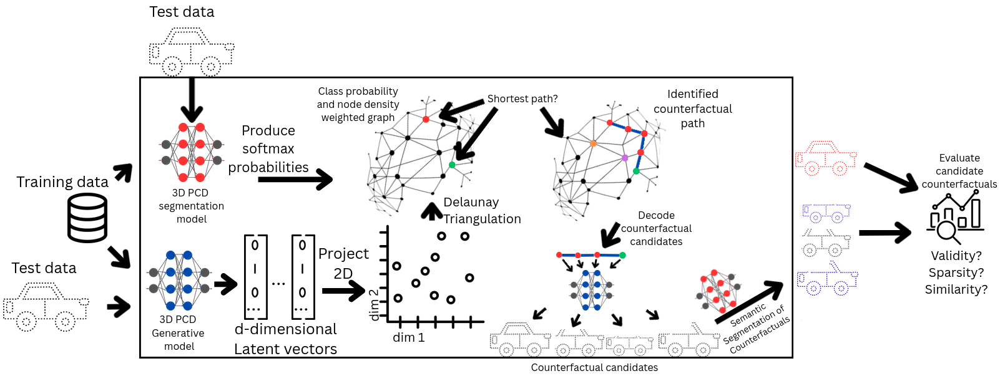

# CXAI3D-2: Explaining 3D Semantic Segmentation through Generative AI-based Counterfactuals
This repository contains the implementation of **CXAI3D**, a generative framework for counterfactual explanations in **3D semantic segmentation**.
The framework introduces a **latent-space navigation approach** to generate counterfactuals for 3D point cloud models. By leveraging **autoencoder-based latent representations**, **UMAP embeddings**, and **graph traversal (Delaunay triangulation + shortest-path search)**, the method produces counterfactual point clouds that remain both **geometrically plausible** and **semantically meaningful**.

<div align="center">
  <div>
    
  </div>
  <p> Figure 1: Graphical Abstract - Schematic diagram of the proposed framework for generating counter-
factuals in 3D PCD.</p>
</div>

---

## Overview

- **PointNet++ Autoencoder** for compact latent representations.  
- **Latent space counterfactual generation** with:
  - UMAP projection for semantic neighborhood preservation.
  - Graph construction via Delaunay triangulation.
  - Geodesic shortest-path search guided by plausibility + classifier confidence.
- **Semantic segmentation classifier** (PointNet++) to validate plausibility.  
- **Interpretability metrics**: 
  - Similarity - closeness to the original point cloud 
  - Validity - intensity in classification change
  - Sparsity - intensity of local change given a epsilon value
- Supports **ShapeNet classes**: car, bus, boat, tower, motorcycle, airplane.  

---

## 📂 Project Structure
```
source/
│── main_syn.py                  # Main script for counterfactual experiments
│
├── generative/                  # Generative Autoencoder Source code 
│   ├── dataset.py
│   ├── model.py                  # Autoencoder (PointNet++ encoder + decoder)
│   ├── pointnet_utils.py
│   ├── train.py
│   ├── train_utils.py
│   └── preds/                    # Example counterfactual outputs (.pcd)
│
├── semseg/                       # Semantic Segmentation Classifier
│   ├── dataset.py
│   ├── model.py                  # PointNet++ semantic segmentation model
│   ├── train.py
│   └── test.py
│
└── scripts/
    └── instance_preprocessing.py # ShapeNet preprocessing
```